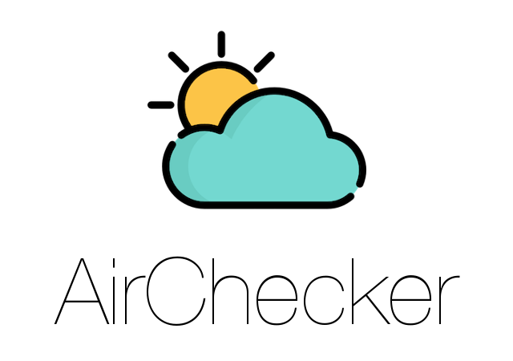
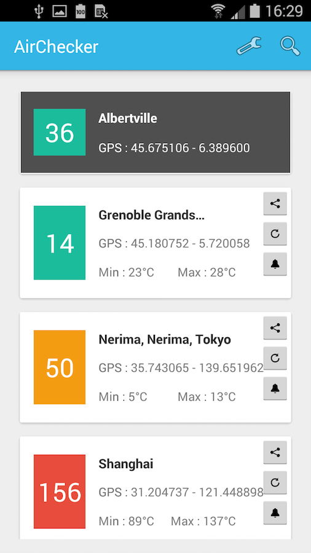
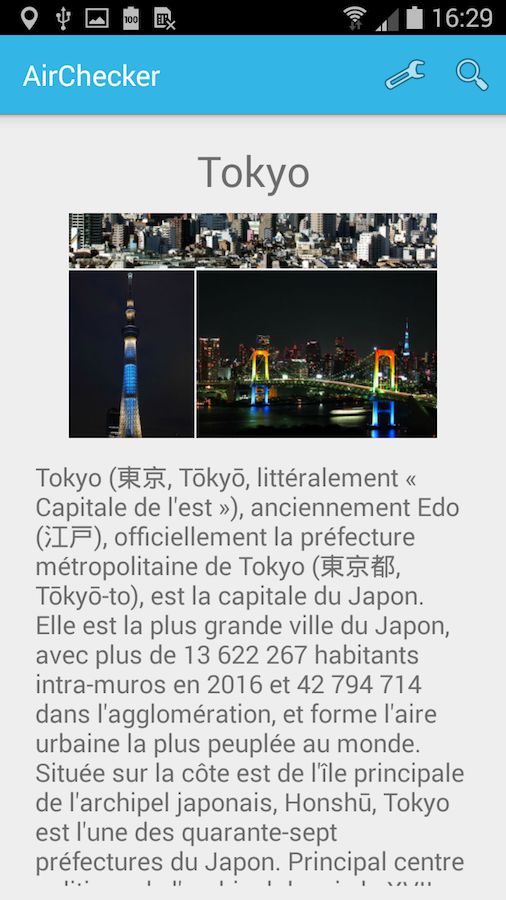
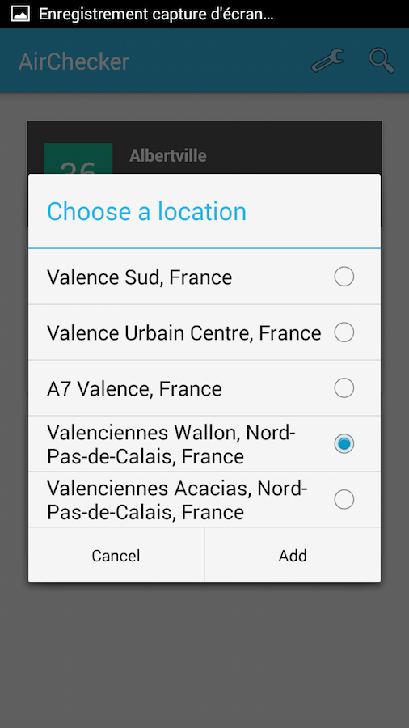
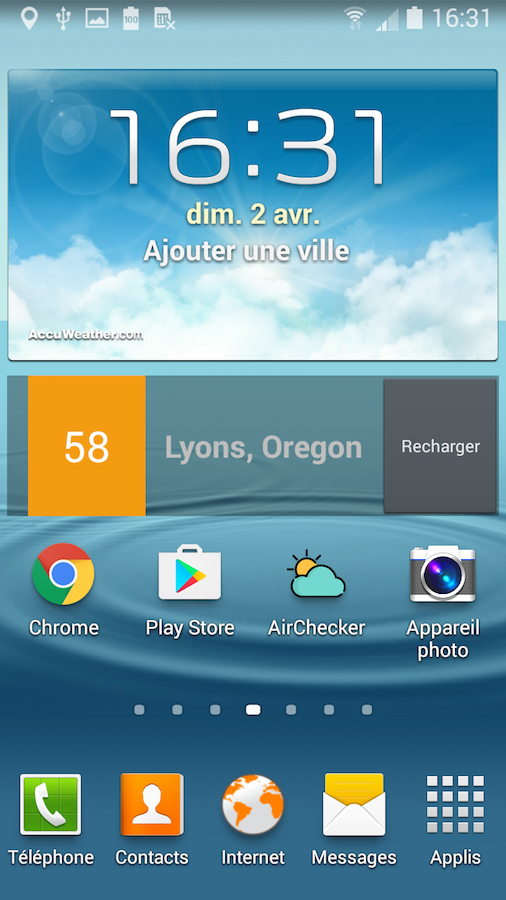
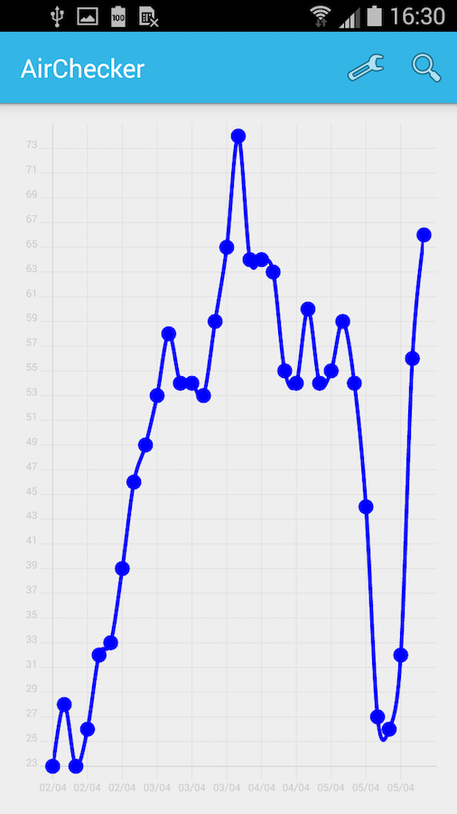
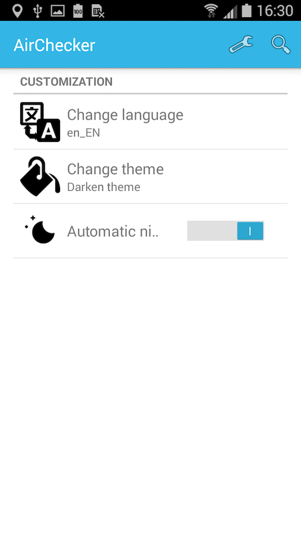

<p align="center">
  
</p>

An Android application to fetch air quality from [**Aqicn**](http://aqicn.org/).

## Screenshots
  
  

## Functionnality

- Show all saved cities with air quality level fetched from [**Aqicn**](http://aqicn.org/).
- Add/delete city.
- French & english support. 
- Share air quality level by mail.
- Play sound according to air quality level.
- Content provider allowing to add/remove a city from other app.
- Air quality chart (powered by [**Hello Chart Android**](https://github.com/lecho/hellocharts-android)).
- 3 themes available (dark, light, sunset).
- Automatic night mode (apply dark theme automatically).
- Display nearest city from user's location.
- Refresh in background all saved cities.
- Send push notifications when air quality is higher than 100.
- Display informations about city.
- Widget of favorite city.

## Compatibility

<table>
<tr>
  <th>Min. version</th>
  <th>Targeted version</th>
  <th>Compiled version</th>
  <th>Android Studio version used</th>
</tr>
<tr>
  <th>Android 4.4</th>
  <th>Android 5.1</th>
  <th>Android 5.1</th>
  <th>2.3</th>
</tr>
</table>

Working on :
- Smartphone
- Tablet

## Installation

- Clone this repository.
```sh
git clone git@github.com:istornz/AirChecker.git
```
- Open the project with [**Android Studio**](https://developer.android.com/studio/index.html)
- Build & run the project.
- Profit :tada:

## Usage

#### Basic usage
- Add a new city by touching the "magnifying glass" icon at top right.
- Type your city on the search field and click on "OK".
- Select on the list your city.
- To delete a city, swipe right/left on it and choose "Yes".

#### Widget
- Add a new city (see [**basic usage**](https://github.com/istornz/AirChecker#basic-usage)).
- Select the city cell in list and touch "Favorite" button at the bottom of details page.
- Add the widget on your homescreen/launchscreen.
- Enjoy :tada:

#### Content provider
- You can add a new city by using the **insert()** method. Pass the city identifier as **identifier** key.
```java
ContentValues aqi = new ContentValues();
aqi.put("identifier", "IDENTIFIER_HERE");
getContentResolver().insert(AirCheckerProvider.CONTENT_URI, aqi);
```
- You can delete a city by using the **delete()** method. Pass the city identifier as **selection** argument.
```java
getContentResolver().delete(AirCheckerProvider.CONTENT_URI, "IDENTIFIER_HERE", null);
```

#### Background service
You can easily change the refresh rate of the background task service.

You can find all params in the **BackgroundRefresher** class.
```java
// Delay value between two request .
private static final int delay = 1800000;
// Air quality level (Greater than or equal fire a notification).
private static final int limit = 100;
```

## Others

To get your keys, please go on the [**Air Quality Open Data Platform register page**](http://aqicn.org/data-platform/token/#/).

## Licenses

- [Google GSON](https://github.com/google/gson)
- [Google Volley](https://github.com/google/volley)
- [Sugar ORM](https://github.com/satyan/sugar)
- [Picasso](https://github.com/square/picasso)
- [HelloCharts](https://github.com/lecho/hellocharts-android)
